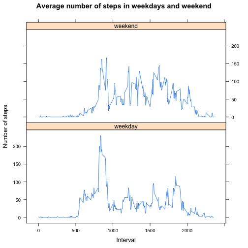

## Loading and preprocessing the data

As first step checks for how many files are in the zip one

```r
 unzip("activity.zip", list = T)
```

```
##           Name Length                Date
## 1 activity.csv 350829 2014-02-11 10:08:00
```


Ghiven that there is only one file of data we can reand directly from the 
zipped file in a data frame (*walk_data* in may case) with the following:

```r
walk_data <- read.csv( unzip("activity.zip"), header = T, sep = ",")
```

Create a data frame without NAs

```r
part_data <- walk_data[which(!is.na(walk_data$steps)),]
```

## What is mean total number of steps taken per day?
In order to get an overview of the total number of setps per day and plot it
on a Histogram we hav to do:


```r
library(dplyr, warn.conflicts = FALSE, quietly = TRUE, verbose = FALSE) 
library(ggplot2)
```

```r
sum_walk <- group_by(part_data,date) %>% summarise(total_day = sum(steps))
ggplot(data = sum_walk, aes(x = total_day)) + geom_histogram(fill=rgb(0.2,0.7,0.1,0.4), color = "white", binwidth = 1000 ) +
        labs(title = "Total Steps per Day", x = "Total Steps", y = "Frequence") +
        theme(plot.title = element_text(hjust = 0.5, face = "bold", size = 14)) +
        theme(axis.title = element_text(face = "bold"))
```


The *mean* and *median* of the total steps per day can be computed in many way,
here you have two methods:

1. using the command *summary*


```r
summary(sum_walk$total_day)
```

```
##    Min. 1st Qu.  Median    Mean 3rd Qu.    Max. 
##      41    8841   10765   10766   13294   21194
```

2. or using directly the functions *mean* 


```r
mean(sum_walk$total_day)
```

```
## [1] 10766.19
```

and *medain* over the same data set


```r
median(sum_walk$total_day)
```

```
## [1] 10765
```

As we can see from the results in both cases we have:

*mean* = 10765

*median* = 10766


## What is the average daily activity pattern?


```r
day_walk <- group_by(part_data,interval) %>% summarise(average_day = mean(steps))
ggplot(data = day_walk, aes(x = interval, y = average_day)) + geom_line(color = "blue") +
        labs(title = "Average Steps per 5-min Intevarls", x = "5-min Intervals", y = "Average number of steps") +
        theme(plot.title = element_text(hjust = 0.5, face = "bold", size = 14)) +
        theme(axis.title = element_text(face = "bold"))
```


```r
part_data[which.max(day_walk$average_day), "interval"]
```

```
## [1] 835
```


## Imputing missing values
The missing value in the data set can be computed as:

```r
sum(is.na(walk_data$steps))
```

```
## [1] 2304
```


In order to replace the NA with sor of *valid* data I substitute the NAs with the corresponding mean value for the 
time interval:

```r
first_method <- walk_data
for (i in 1:length(walk_data$steps)) {
        if (is.na(walk_data$steps[i])) {
                first_method$steps[i] = day_walk$average_day[which(day_walk$interval==first_method$interval[i])]}
}
```

Therefore, the new plot is the following:

```r
sum2_walk <- group_by(first_method,date) %>% summarise(total_day = sum(steps))
ggplot(data = sum2_walk, aes(x = total_day)) + geom_histogram(fill=rgb(0.2,0.7,0.1,0.4), color = "white", binwidth = 1000 ) +
        labs(title = "Total Steps per Day", x = "Total Steps", y = "Frequence") +
        theme(plot.title = element_text(hjust = 0.5, face = "bold", size = 14)) +
        theme(axis.title = element_text(face = "bold"))
```


The *mean* and *median* of the total steps per day can be computed as before:


```r
summary(sum2_walk$total_day)
```

```
##    Min. 1st Qu.  Median    Mean 3rd Qu.    Max. 
##      41    9819   10766   10766   12811   21194
```
As we can see from the results now we have:

*mean* = *median* = 10766

Therefore, filling the missing value doesn't change significantly the results in terms of *mean* and *median*, even though the NAs count for more than the 13% of the steps values.

```r
mean(is.na(walk_data$steps))
```

```
## [1] 0.1311475
```
However, it fit the histogram more close to a gaussian reducing the interval between the 1th and the 4th quantiles.


## Are there differences in activity patterns between weekdays and weekends?

At first we have to add a new column to the data set in order to classify the weekdays against the weekend

```r
weekd <- c("Monday","Tuesday","Wednesday","Thursday","Friday")
weekend <- c("Saturday","Sunday")

first_method$days <- as.factor(sapply(first_method$date, function(x) {if(weekdays(as.Date(x))%in%weekd) {"weekday"} else {"weekend"}}))
```

Than we compute the summary of means for each inteval for all days and plot the two timelines

```r
day_walk <- group_by(first_method,interval,days) %>% summarise(average_day = mean(steps))

library(lattice)

xyplot(average_day~interval | days, data = day_walk, type = "l", layout = c(1,2), 
       xlab = "Interval", ylab = "Number of steps", 
       main = "Average number of steps in weekdays and weekend")
```



